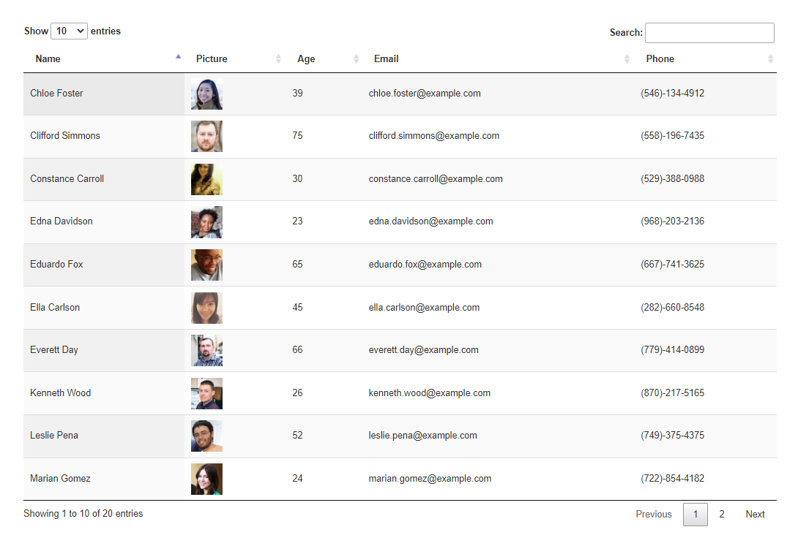

# Jquery Datables Example

## Description
Tutorial on implementation of Jquery datatable using random user API to generate a list of employee.
## Table of contents
* [Description](#Description)
* [Installation](#Installation)
* [Usage](#Usage)
* [License](#License)
* [Contributing](#Contributing)
* [Test](#Test)
* [Screenshot](#Screenshot)
* [Questions](#Questions)
## Installation
none
## Usage
feel free to use it.
## Licence
This app is under the MIT License.
## Contributing
feel free to contact me for anything.
## Test
none
## Screenshot

## Questions
Contact me: kevkouadio@gmail.com

My Github: http://github.com/kevkouadio